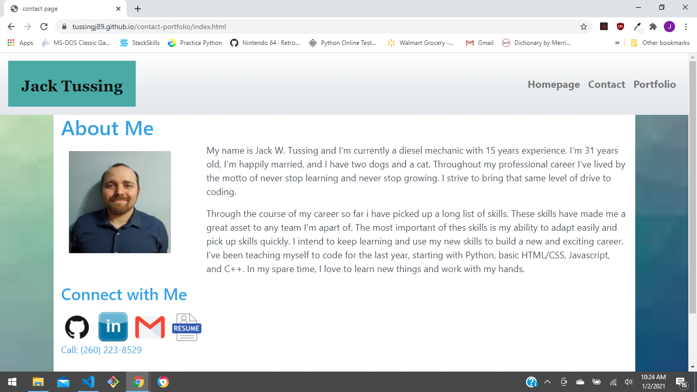

# contact-portfolio
This project focuses on using media break points for a responsive webpage. Thoughout this project I employed the use of HTML girds to layout my webpage in a well organized manner. I've also used this project to showcase how cards can add a great element to a webpage.

# no install, no wait

This file works on any webpage, so the viewing of this project is as simple as following the link listed below.
https://tussingj89.github.io/contact-portfolio/

# technologys used
html, css, and bootstrap

# easy-to-read grids

Below is a sample of the code using HTML grid layout. As you can see the code is layed out in a way that makes its location on the screen easy to understand.

              

                  <h1>Contacts</h1>
            

            

                

                    <h3>Name:</h3>
            

            

                <input id="name" type="text" class="input" placeholder="John Doe">
            

            

                

                    <h3>Email:</h3>
            

            

                <input id="email" type="text" class="input" placeholder="example@email.com">
            

            

                

                    <h4>Message:</h4>
            

            

                <textarea rows="4" id="message" class="input" placeholder="message:"></textarea>
            

            <button type="submit" class="btn btn-primary" >Submit</a>
        

# snapshot of the webpage

# contact me at:
tussing40@gmail.com
